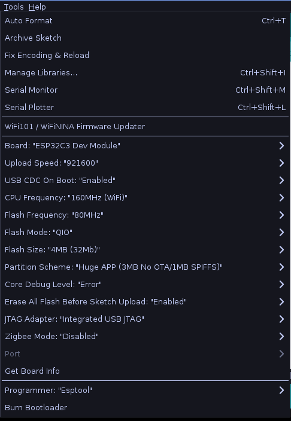

# Plantbud Firmware

To successfully flash the firmware, make sure the following libraries are installed in Arduino:

- [NimBLE == 2.2](https://github.com/h2zero/NimBLE-Arduino)
- [GxEPD2 == 1.6.4](https://github.com/ZinggJM/GxEPD2)
- [Adafruit GFX Library == 1.12.1](https://github.com/adafruit/Adafruit-GFX-Library)

All of the libraries above are available through the Arduino Library Manager.

Additionally, ensure that the Espressif Core is installed via the Board Manager in Arduino:

- [arduino-esp32 == 3.2.0](https://github.com/espressif/arduino-esp32)

## Example Configuration

